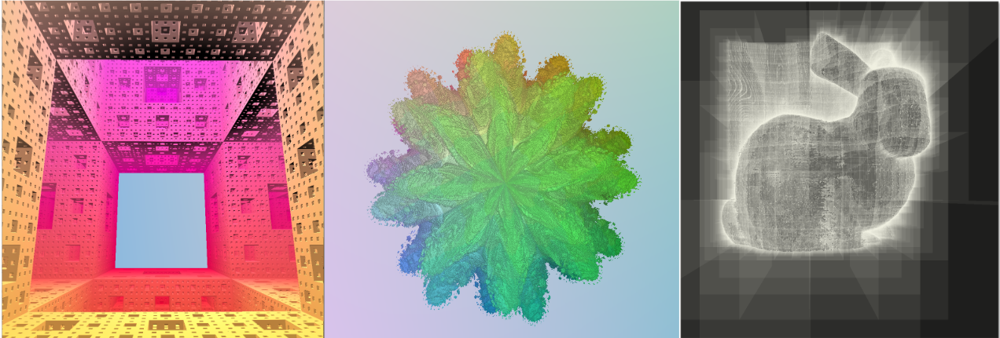

# zazen
3D sparse voxel octree engine

[Dissertation in Portuguese](https://repositorio.ufsc.br/bitstream/handle/123456789/202673/TCC.pdf?sequence=1&isAllowed=y)

[Presentation in Portuguese](https://docs.google.com/presentation/d/1tApOPQa1h_Ap4Q5-Xljjrs0dZl0Z6xPQ2VvMCYRxZok/edit#slide=id.p)

https://www.youtube.com/watch?v=cauwMJJkcEM
